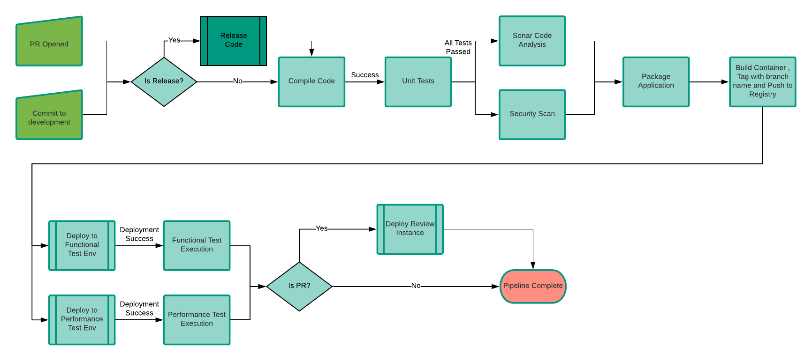

# Gitflow Pipeline
This CI/CD pipeline models the [Gitflow development model](https://datasift.github.io/gitflow/IntroducingGitFlow.html). New features  are developed on a `feature` branch. When the feature is has passed QA and is considered ready for release, a Pull Request (PR) is opened against the `master` branch and the feature is merged in. The `master` branch is always kept stable and ready for release at any time. When the ready to release, a tag is made and the application container image is promoted to staging

## Triggers
The pipeline is triggered under the following scenarios:
* PR opened against the `master` branch
* Commit to the `master` branch
* Manual execution

## Input Parameters
* Release Version Number - Setting this parameter triggers a code release.
* Next Development Version Number - Required for Release.

## Pipeline Steps
When a commit is made to the `mastere` branch or a  PR is opened against the `master` branch, the pipeline is triggered.
1. **Check if build is a release** 
If the release and development version number parameters are set, then execute the [release process](release.md).
1. **Compile Source Code** 
Compile the source code
1. **Unit Test Execution** 
Execute Unit tests
1. In Parallel:
    * **Sonar Code Analysis** 
    Run Sonar analysis against source code to ensure good code coverage and check for bad coding practices.
    _Not yet implemented._ 
    * **Security Code Analysis** 
    Analyze the source code potential security issues. _Not yet implemented._
1. **Package and upload artifacts to repository** 
Build the application Docker container images and push them to our image repository.
1. In Parallel:
    * **Deploy application and execute Functional Tests**
    Deploy the application to an ephemeral test environment for execution of functional test cases. Execute functional test cases by running `mvn integration-test`. Tears down the instance when tests are complete.
    * **Deploy application and execute Performance Tests**
    Deploy the application to an ephemeral test environment for execution of performance test cases. Tears down the instance when tests are complete. _Not yet implemented._
1. **Deploy Review Instance** 
If this build is for a PR, then the pipeline will deploy an instance of application using the PR build. This can be used during review of the PR and any acceptance testing of the feature before the PR is merged. This instance will be torned down by Jenkins when the PR is closed.
1. If this is the `master` branch, the pipeline will tag the container images with `dev-{COMMIT_ID}`, thereby triggering Flux to promote the container to the Dev environment. See [Deployments and Promotion](../deployment-config) for more information on this topic.

If any failures occur or quality gates are not passed, the build will be failed and a Slack notification will be sent out.

## Outputs
If the pipeline completes successfully, the following outputs will have been created:
* Unit Test results - The results of the unit tests will be attached to the build result in Jenkins
* Sonar Code Analysis - The static analysis of the code by Sonar will be available within the Sonar server for non-PR builds. For PR builds, the results will added as comments to the PR itself.
* Docker Container - Any Docker containers built by the pipeline will be pushed to the Nexus docker repository and tagged with the branch name or PR build number. If this was a release build, the container will also be tagged with the release number.
* Review Instance - Deployed instance of the built application to used for PR review and feature acceptance testing.